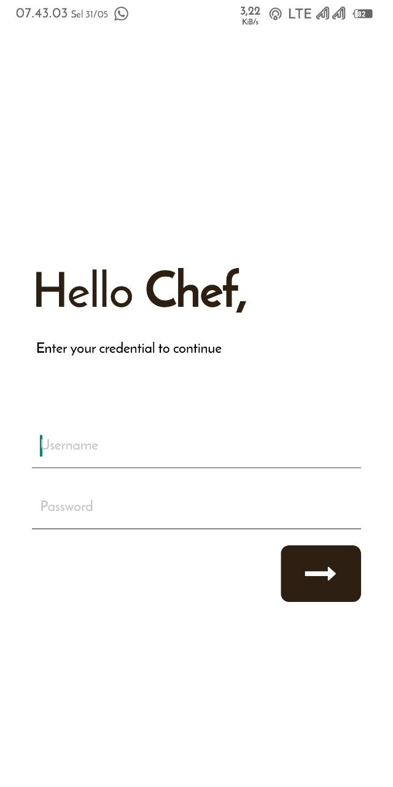
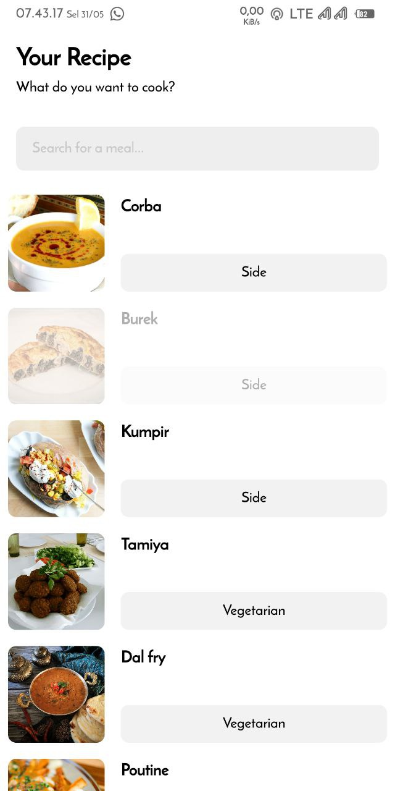
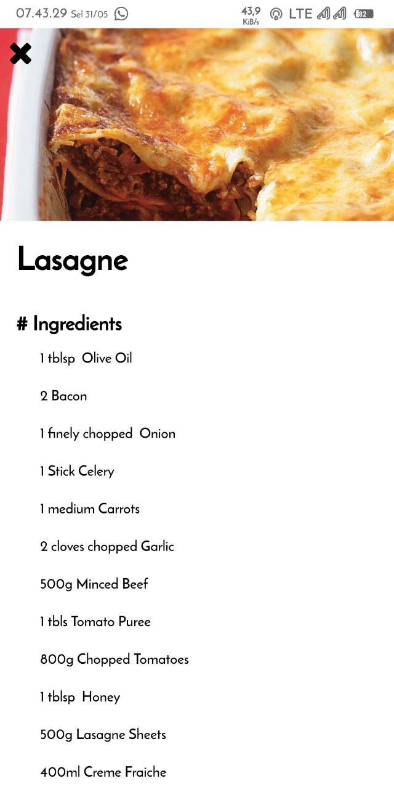

## Aplikasi Resep Makanan `RecipeMe` :bowl_with_spoon:

Aplikasi `RecipeMe` merupakan aplikasi daftar resep makanan dengan data resep yang didapat dari [Call API](https://www.themealdb.com/api/json/v1/1/search.php?s=)

### Anggota Tim :cyclone:
1. Agusto Hawlai Rajagukguk - 119140119
2. Ahmad Syafarudin - 119140044
3. Albab Jannatul Firdaus - 119140097
4. Jaysyu Muhammad S.W - 119140198

#### Antar Muka Aplikasi `RecipeMe` :iphone:


Pada awal akses aplikasi pengguna diharap login untuk masuk ke layar beranda dengan akun default :
```
username : Chef
password : 12345
```


Setelah login berhasil maka akan diarahkan ke Layar Beranda aplikasi `RecipeMe` dengan berbagai list Menu Makanan



Bagian detail resep dapat diakses dengan melakukan `klik` pada list Menu Beranda

#### Download :arrow_down:
[Releases](https://github.com/agustohr/UAS_PAM/releases)
